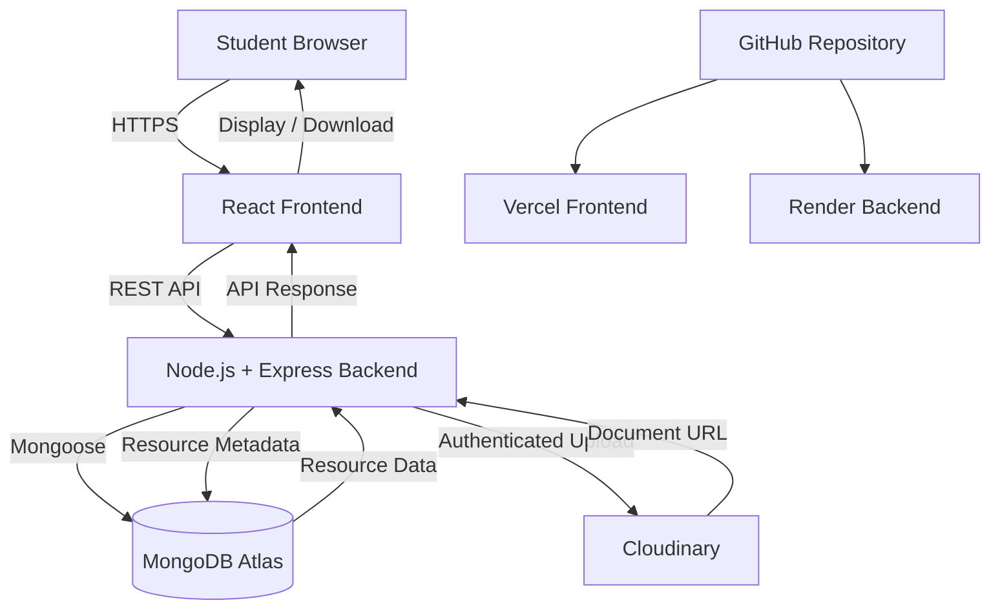
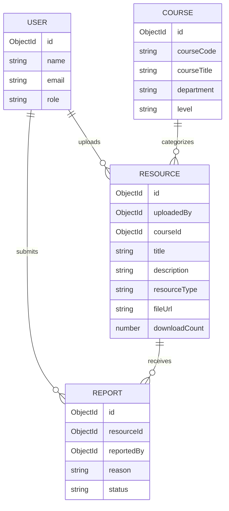
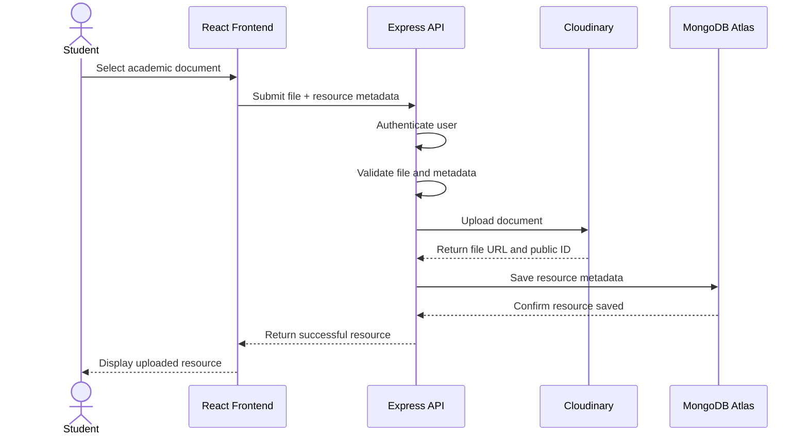
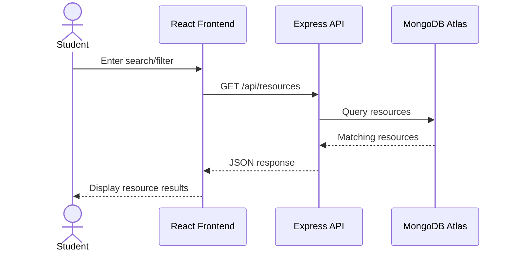
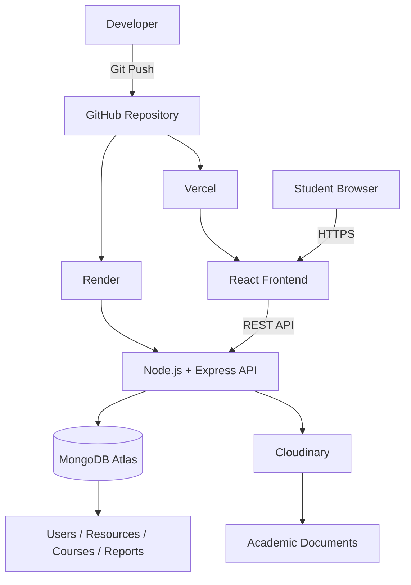
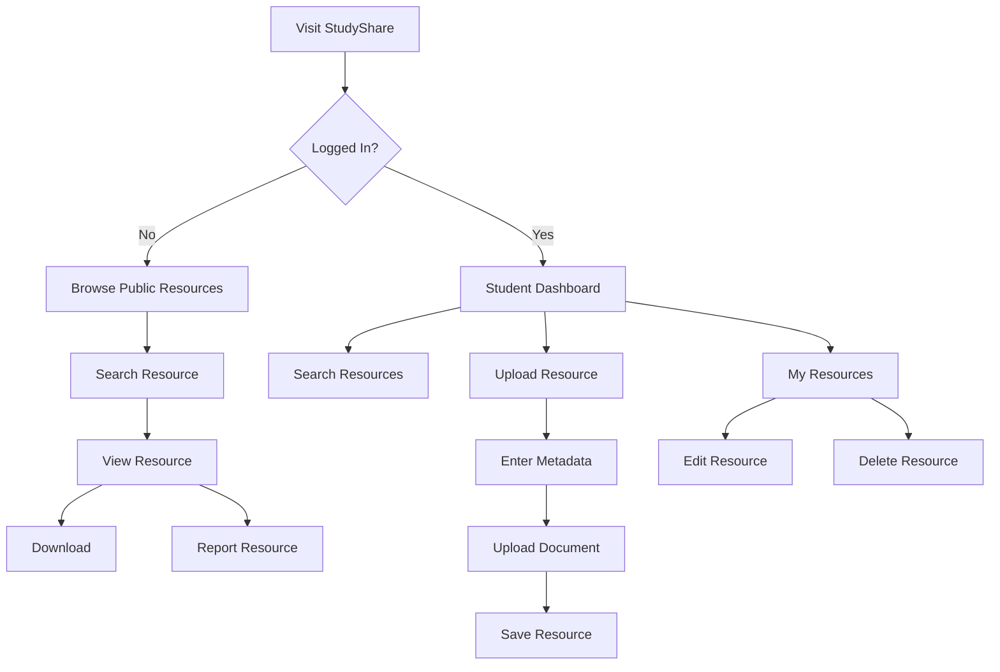

# Student Resource Sharing Platform

## StudyShare — Final Project Research and System Architecture

**Project Domain:** Education Technology (EdTech)
**Project Type:** Cloud-Based Web Application
**Project Name:** StudyShare
**Document Status:** Final Research and System Architecture
**Target Users:** University and College Students

---

## 1. Project Overview

StudyShare is a cloud-based web platform designed to help students upload, discover, organize, and download academic learning resources.

Students commonly receive academic materials through different channels such as WhatsApp groups, Telegram groups, email, personal cloud storage, and direct peer-to-peer sharing. Although these channels make sharing easy, they do not provide a structured way to organize resources according to course, department, academic level, or resource type.

StudyShare addresses this problem by providing a centralized academic resource repository where students can find relevant materials using search and filters.

The platform will support resources such as:

* Lecture notes
* Course summaries
* Study guides
* Past examination questions
* Assignment guides
* Revision materials
* Academic reference documents

The first version will focus on resource discovery and sharing rather than attempting to become a complete Learning Management System (LMS).

---

# 2. Real-World Problem Identification

## 2.1 Problem Statement

Students have access to a large amount of digital academic content, but the content is often scattered across informal communication channels.

For example, a student looking for past questions for a particular course may need to search through several WhatsApp conversations, ask classmates to resend files, or search through personal storage. Important resources can become difficult to find because:

* Files are shared across different platforms.
* File names are often inconsistent.
* Resources are not always organized by course or academic level.
* Old resources can become mixed with newer ones.
* Students may not know whether a resource is relevant to their course.
* Important materials can be lost when a student leaves a group or changes devices.
* Students may have difficulty determining whether a shared document is appropriate or legally permitted to redistribute.

Therefore, the problem is not simply a lack of educational materials. It is also a problem of **discoverability, organization, accessibility, and responsible sharing of educational resources**.

StudyShare proposes a centralized platform where students can upload and discover resources using structured metadata such as course code, department, academic level, and resource type.

---

# 3. Research and Literature Review

## 3.1 Open Educational Resources

The concept of Open Educational Resources (OER) provides an important foundation for this project.

UNESCO defines OER as teaching, learning, and research materials that are either in the public domain or released under an open licence that permits activities such as access, reuse, adaptation, and redistribution.

This distinction is important for StudyShare because not every academic document available online can automatically be redistributed. The platform must therefore encourage responsible sharing and require users to confirm that they have permission to upload materials.

**Source:** UNESCO, Recommendation on Open Educational Resources.

---

## 3.2 Benefits of Educational Resource Sharing

Research indicates that digital educational resources can improve access to learning materials.

A systematic review by Adil et al. examined 21 studies concerning the benefits and challenges of Open Educational Resources. The review identified benefits including:

* Expanded access to knowledge
* Support for lifelong learning
* Pedagogical benefits
* Potential improvements in student learning outcomes

However, the review also identified several challenges, including:

* Difficulty finding appropriate resources
* Lack of awareness about copyright
* Quality assurance
* Technological limitations
* Lack of organizational support

These findings are particularly relevant to StudyShare.

The platform therefore does not only provide a place to upload files. Its design specifically addresses the problem of **finding and organizing appropriate resources** through structured categories and search functionality.

**Source:** Adil, Ali, Sultan, Ashiq & Rafiq, *Open education resources' benefits and challenges in the academic world: a systematic review*.

---

## 3.3 Digital Access and Educational Technology

UNESCO's 2023 Global Education Monitoring Report highlights both the opportunities and limitations of technology in education.

The report explains that digital technology can improve access to educational content, but access to devices, electricity, internet connectivity, digital skills, and appropriate content remains unequal.

The report also identifies a challenge with digital educational content: the large volume of available resources makes it difficult to assess their quality and relevance.

This supports the need for StudyShare to remain lightweight and focused. The platform will prioritize:

* Responsive design
* Simple navigation
* Search and filtering
* Common document formats
* Efficient resource listings
* Minimal unnecessary bandwidth usage

StudyShare will not claim that providing a digital repository automatically solves educational inequality or improves academic performance. Instead, the project focuses on making existing learning resources easier to organize and discover.

---

## 3.4 Nigerian Context

Research on students' access to learning resources in universities in Southwest Nigeria has also examined differences in students' access to and utilization of learning resources.

A study involving 585 students across 12 public and private universities in Southwest Nigeria examined access to and utilization of learning resources.

This provides additional context for considering digital resource accessibility within the Nigerian higher-education environment.

StudyShare is therefore designed as a practical student-centered solution that can be used across different institutions rather than being tied to one university's internal academic system.

---

# 4. Research Findings

The research identifies four major issues relevant to the proposed system:

| Research Finding                                          | StudyShare Response                                                                 |
| --------------------------------------------------------- | ----------------------------------------------------------------------------------- |
| Students need access to learning materials                | Provide a centralized resource repository                                           |
| Finding relevant resources can take time                  | Provide keyword search and filters                                                  |
| Educational resources can have copyright restrictions     | Require uploaders to confirm sharing rights                                         |
| Quality and relevance can be difficult to determine       | Display descriptions, course information, contributor details and reporting options |
| Digital access can be limited                             | Use a lightweight, responsive web interface                                         |
| Large numbers of resources can become difficult to manage | Use categories, metadata, pagination and database indexes                           |

The research therefore supports the development of a focused resource-sharing platform rather than a complete LMS.

---

# 5. Proposed Solution

StudyShare will provide a searchable academic resource repository.

A student will be able to:

1. Create an account.
2. Sign in securely.
3. Browse available resources.
4. Search for resources by keyword.
5. Filter resources by course, department, level, and type.
6. View resource details.
7. Download available resources.
8. Upload academic resources.
9. Edit or delete their own uploaded resources.
10. Report inappropriate or unauthorized content.

The system will use MongoDB to store application data and Cloudinary for cloud-based document storage.

---

# 6. Aim

The aim of StudyShare is to design, develop, and deploy a secure cloud-based platform that enables students to efficiently share, organize, discover, and access academic learning resources.

---

# 7. Objectives

The project objectives are to:

1. Develop a centralized platform for sharing academic resources.
2. Provide structured resource categorization using course, department, level, and resource type.
3. Implement secure student registration and authentication.
4. Provide search and filtering functionality.
5. Allow authenticated students to upload permitted academic documents.
6. Store application data using MongoDB.
7. Store uploaded documents using cloud-based file storage.
8. Implement access control for user-owned resources.
9. Provide a reporting mechanism for inappropriate or unauthorized content.
10. Deploy the application to a public cloud environment.
11. Test the system for functionality, usability, security, and responsiveness.

---

# 8. Project Scope

## 8.1 Included Features

The first version will include:

* Student registration
* Student login and logout
* User profile
* Resource upload
* Resource title and description
* Course code
* Course title
* Department
* Academic level
* Resource type
* Keyword search
* Resource filtering
* Resource details
* Resource download
* Upload history
* Edit uploaded resource
* Delete uploaded resource
* Report resource
* Responsive web interface
* Basic administrative moderation capability

---

## 8.2 Excluded Features

The first version will not include:

* Live chat
* Video conferencing
* Online examinations
* Online payments
* AI-based recommendations
* Automated plagiarism detection
* Institutional student-record integration
* Native Android application
* Native iOS application
* Full Learning Management System functionality
* Complex social networking features

These features may be considered in future versions.

---

# 9. Functional Requirements

| ID    | Requirement                                                         |
| ----- | ------------------------------------------------------------------- |
| FR-01 | Visitors can browse publicly available resources.                   |
| FR-02 | Students can create an account.                                     |
| FR-03 | Students can securely log in and log out.                           |
| FR-04 | Authenticated students can upload permitted academic documents.     |
| FR-05 | Users must provide required resource metadata during upload.        |
| FR-06 | Users can search resources by title, course code, or keyword.       |
| FR-07 | Users can filter resources by department, level, and resource type. |
| FR-08 | Users can view resource details.                                    |
| FR-09 | Users can download available resources.                             |
| FR-10 | Resource owners can edit their own resources.                       |
| FR-11 | Resource owners can delete their own resources.                     |
| FR-12 | Users can report inappropriate or unauthorized resources.           |
| FR-13 | Administrators can review reported resources.                       |
| FR-14 | The application provides appropriate validation and error messages. |

---

# 10. Non-Functional Requirements

### Usability

The system should be simple enough for students to use without formal training.

### Accessibility

The interface should use semantic HTML, readable typography, clear labels, keyboard-accessible controls, and appropriate colour contrast.

### Security

The application should protect authentication credentials, restrict unauthorized actions, validate uploads, and protect environment secrets.

### Performance

Resource lists should use pagination rather than loading every resource simultaneously.

### Reliability

The system should use managed cloud services where practical and provide appropriate error handling.

### Maintainability

The application should separate frontend components, API routes, database models, validation, authentication, and configuration.

### Scalability

The system should allow the number of users and resources to increase without requiring a complete architectural redesign.

### Privacy

Only information required for the operation of the platform should be collected and sensitive account information should not be publicly displayed.

---

# 11. System Architecture

## 11.1 Architecture Overview

StudyShare will use a **MERN-style architecture** consisting of:

* **React** — frontend
* **Node.js** — backend runtime
* **Express.js** — REST API
* **MongoDB Atlas** — cloud database
* **Mongoose** — MongoDB object modelling
* **Cloudinary** — cloud file storage
* **Vercel** — frontend deployment
* **Render** — backend API deployment
* **GitHub** — source-code management
* **GitHub Actions** — automated testing and build checks

MongoDB is intentionally used as the primary database because it was covered during the course and is appropriate for storing flexible resource metadata.

MongoDB Atlas provides a managed cloud environment for MongoDB and supports deployment across major cloud providers, making it appropriate for the cloud-based requirement of this project.

---

# 12. High-Level Architecture Diagram



---

# 13. Architecture Components

## 13.1 Frontend

The frontend will be developed using React.

Responsibilities include:

* User interface
* Navigation
* Authentication forms
* Resource browsing
* Search
* Filtering
* Upload interface
* Resource details
* User dashboard
* Error and success messages
* Responsive design

React is suitable because the application contains reusable UI elements such as resource cards, search controls, filters, forms, navigation, and dashboards.

---

# 14. Backend

The backend will use:

* Node.js
* Express.js
* Mongoose

The backend will act as the application API between the React frontend, MongoDB database, and Cloudinary.

Responsibilities include:

* Authentication
* Authorization
* API routing
* Request validation
* Resource management
* File upload handling
* Database operations
* Report management
* Error handling

Example API structure:

```text
/api/auth
/api/users
/api/resources
/api/courses
/api/reports
```

Example resource endpoints:

```text
GET    /api/resources
GET    /api/resources/:id
POST   /api/resources
PUT    /api/resources/:id
DELETE /api/resources/:id

GET    /api/resources/search
GET    /api/resources/filter
```

---

# 15. Database — MongoDB Atlas

MongoDB will be the primary application database.

MongoDB is a document-oriented NoSQL database. Its document model is appropriate for StudyShare because resource information can contain flexible metadata that may evolve as the project develops.

MongoDB Atlas will provide the cloud-hosted database environment.

The database will contain collections such as:

```text
users
resources
courses
reports
```

MongoDB Atlas is suitable for the project because it provides a managed MongoDB environment, reducing the need to manually maintain database infrastructure.

---

# 16. Proposed MongoDB Data Model

## 16.1 Users Collection

```javascript
{
  _id: ObjectId,
  name: String,
  email: String,
  password: String,
  role: String,
  department: String,
  level: String,
  createdAt: Date,
  updatedAt: Date
}
```

The password will never be stored as plain text. It will be securely hashed before being stored.

---

## 16.2 Resources Collection

```javascript
{
  _id: ObjectId,
  title: String,
  description: String,
  courseCode: String,
  courseTitle: String,
  department: String,
  level: String,
  resourceType: String,

  fileUrl: String,
  publicId: String,
  fileName: String,
  fileSize: Number,

  uploadedBy: ObjectId,

  sharingPermissionConfirmed: Boolean,

  downloadCount: Number,

  createdAt: Date,
  updatedAt: Date
}
```

The resource document will store metadata and the cloud-storage reference rather than storing the actual document binary directly in MongoDB.

---

## 16.3 Courses Collection

```javascript
{
  _id: ObjectId,
  courseCode: String,
  courseTitle: String,
  department: String,
  level: String,
  createdAt: Date
}
```

Courses can be reused by multiple resources.

---

## 16.4 Reports Collection

```javascript
{
  _id: ObjectId,
  resourceId: ObjectId,
  reportedBy: ObjectId,
  reason: String,
  description: String,
  status: String,
  createdAt: Date,
  updatedAt: Date
}
```

Possible report statuses:

```text
pending
reviewed
resolved
dismissed
```

---

# 17. MongoDB Relationship Model

Although MongoDB is a NoSQL database, relationships can still be represented through document references.



The diagram represents logical relationships rather than traditional relational database tables.

---

# 18. File Storage Architecture

Academic documents will not be stored directly inside MongoDB.

Instead:

```text
Student
   |
   v
React Frontend
   |
   v
Express API
   |
   v
Cloudinary
   |
   +---- Document URL
   |
   v
MongoDB
```

Cloudinary will store the uploaded documents and return a file URL and identifier.

MongoDB will store:

* File URL
* Cloudinary public ID
* File name
* File size
* Resource metadata

This separation prevents the application database from being unnecessarily responsible for large file storage.

---

# 19. Main Resource Upload Flow



---

# 20. Resource Discovery Flow



MongoDB indexes will be created for commonly queried fields such as:

```text
courseCode
department
level
resourceType
createdAt
title
```

For larger datasets, MongoDB Atlas Search can be considered for more advanced full-text search.

---

# 21. Authentication and Authorization

The application will implement secure authentication using:

* Password hashing with bcrypt
* JWT-based authentication
* Protected API routes
* Role-based authorization

Example roles:

```text
student
admin
```

### Student permissions

Students can:

* View resources
* Search resources
* Download resources
* Upload resources
* Edit their own resources
* Delete their own resources
* Report resources

### Administrator permissions

Administrators can:

* View reported resources
* Review reports
* Remove inappropriate resources
* Manage users where required
* Manage resource categories

A student should not be able to modify or delete another student's resource.

---

# 22. Security Design

Security considerations include:

### Password Security

Passwords will be hashed using bcrypt before being stored.

### Authentication

Protected API endpoints will require a valid authentication token.

### Authorization

The backend will verify that users have permission to perform operations.

For example:

```text
Student A → Can edit Student A's resource
Student A → Cannot edit Student B's resource
```

### File Validation

The initial version will support selected document formats, primarily PDF.

The backend will validate:

* File type
* File size
* File name
* Required metadata

Validation will not rely solely on frontend checks.

### Environment Variables

Sensitive credentials will be stored using environment variables.

Example:

```env
MONGODB_URI=
JWT_SECRET=
CLOUDINARY_CLOUD_NAME=
CLOUDINARY_API_KEY=
CLOUDINARY_API_SECRET=
```

These values must not be committed to GitHub.

### API Security

The backend should also apply:

* CORS configuration
* Rate limiting where appropriate
* Input validation
* Secure HTTP headers
* Proper error handling
* Authentication middleware

---

# 23. Responsible Sharing and Copyright

Academic resource sharing creates an important legal and ethical consideration.

StudyShare will therefore require uploaders to confirm that they have the right or permission to share the material.

For example:

```text
[ ] I confirm that I have permission to share this resource.
```

The platform will also provide a report option for users who believe that a resource:

* Violates copyright
* Contains inappropriate content
* Contains misleading information
* Does not belong on the platform
* Was uploaded without permission

StudyShare will not claim that every uploaded resource is officially approved by an educational institution.

The platform will provide mechanisms for reporting and removing problematic content, while recognizing that complete content verification is outside the scope of the initial prototype.

---

# 24. Technology Stack

| Layer            | Technology                     | Purpose                                 |
| ---------------- | ------------------------------ | --------------------------------------- |
| Frontend         | React                          | User interface                          |
| Build Tool       | Vite                           | Development and production build        |
| Styling          | Tailwind CSS                   | Responsive UI                           |
| Backend          | Node.js                        | Server runtime                          |
| API Framework    | Express.js                     | REST API                                |
| Database         | MongoDB                        | Application data                        |
| Database Hosting | MongoDB Atlas                  | Cloud database                          |
| ODM              | Mongoose                       | MongoDB schema and database interaction |
| Authentication   | JWT + bcrypt                   | Authentication and password security    |
| File Storage     | Cloudinary                     | Cloud document storage                  |
| Frontend Hosting | Vercel                         | React deployment                        |
| Backend Hosting  | Render                         | Express API deployment                  |
| Version Control  | Git + GitHub                   | Source-code management                  |
| Testing          | Vitest / React Testing Library | Frontend testing                        |
| API Testing      | Postman / Thunder Client       | API testing                             |
| CI               | GitHub Actions                 | Automated checks                        |

---

# 25. Technology Justification

## React

React provides reusable components and is suitable for creating a responsive resource catalogue, forms, dashboards, search interfaces, and authentication pages.

## Node.js and Express

Node.js and Express provide a straightforward way to build REST APIs and connect the frontend to MongoDB.

This also allows the project to use JavaScript throughout the application stack.

## MongoDB

MongoDB is the core database selected for this project.

Its document model provides flexibility for resource metadata and allows the project to apply concepts taught during the course, including:

* Collections
* Documents
* CRUD operations
* Queries
* Indexes
* ObjectId references
* Aggregation where necessary

## MongoDB Atlas

MongoDB Atlas provides a managed cloud environment for MongoDB. This removes the need to manually maintain a database server while allowing the project to meet the cloud deployment requirement.

## Mongoose

Mongoose will provide schema definitions, validation, models, and database interaction between the Node.js application and MongoDB.

## Cloudinary

Cloudinary will handle uploaded academic documents separately from MongoDB. This keeps MongoDB focused on application data and metadata.

## Vercel

Vercel will host the React frontend and provide a public HTTPS deployment.

## Render

Render will host the Node.js and Express backend API.

This separation makes the frontend and backend independently deployable.

---

# 26. Complete Cloud Architecture



---

# 27. Deployment Architecture

The system will use three major cloud services:

### Frontend

```text
Vercel
   |
   └── React Application
```

### Backend

```text
Render
   |
   └── Node.js + Express API
```

### Database

```text
MongoDB Atlas
   |
   └── StudyShare Database
```

### File Storage

```text
Cloudinary
   |
   └── Academic Documents
```

---

# 28. Deployment Process

## Step 1 — Source Code

Create the project repository on GitHub.

```text
studyshare/
├── client/
├── server/
├── README.md
└── .gitignore
```

## Step 2 — MongoDB Atlas

Create a MongoDB Atlas project and database.

Configure:

* Database user
* Database access
* Network access
* Connection string
* Collections

## Step 3 — Backend

Deploy the Express backend to Render.

Configure environment variables:

```env
MONGODB_URI=
JWT_SECRET=
CLOUDINARY_CLOUD_NAME=
CLOUDINARY_API_KEY=
CLOUDINARY_API_SECRET=
CLIENT_URL=
```

## Step 4 — Frontend

Deploy the React application to Vercel.

Configure:

```env
VITE_API_URL=
```

The frontend will use the deployed backend URL to communicate with the API.

## Step 5 — Testing

Test:

* Registration
* Login
* Logout
* Resource upload
* Resource search
* Filtering
* Resource download
* Resource editing
* Resource deletion
* Reporting
* Authorization
* Mobile responsiveness

---

# 29. Project Structure

The proposed project structure is:

```text
studyshare/
│
├── client/
│   ├── src/
│   │   ├── components/
│   │   ├── pages/
│   │   ├── layouts/
│   │   ├── services/
│   │   ├── hooks/
│   │   ├── context/
│   │   ├── utils/
│   │   ├── App.jsx
│   │   └── main.jsx
│   │
│   └── package.json
│
├── server/
│   ├── config/
│   ├── controllers/
│   ├── middleware/
│   ├── models/
│   ├── routes/
│   ├── services/
│   ├── utils/
│   ├── app.js
│   └── server.js
│
├── .gitignore
├── README.md
└── package.json
```

This structure separates the user interface from backend responsibilities and makes the application easier to maintain.

---

# 30. API Design

## Authentication

```text
POST /api/auth/register
POST /api/auth/login
GET  /api/auth/me
POST /api/auth/logout
```

## Resources

```text
GET    /api/resources
GET    /api/resources/:id
POST   /api/resources
PUT    /api/resources/:id
DELETE /api/resources/:id
```

## Search and Filtering

```text
GET /api/resources?search=javascript
GET /api/resources?courseCode=CSC301
GET /api/resources?department=Computer Science
GET /api/resources?level=300
GET /api/resources?resourceType=past-question
```

## Reports

```text
POST /api/reports
GET  /api/reports
PUT  /api/reports/:id
```

The final API implementation may combine or modify these routes depending on development requirements.

---

# 31. User Flow



---

# 32. Core System Modules

## 32.1 Authentication Module

Handles:

* Registration
* Login
* Logout
* Session/token management
* User roles

## 32.2 Resource Module

Handles:

* Uploading
* Viewing
* Editing
* Deleting
* Downloading

## 32.3 Search Module

Handles:

* Keyword search
* Course search
* Department filtering
* Level filtering
* Resource type filtering

## 32.4 Course Module

Handles:

* Course information
* Course codes
* Course categories
* Department associations

## 32.5 Report Module

Handles:

* Resource reporting
* Report status
* Administrative review

## 32.6 Administration Module

Handles basic moderation activities such as reviewing reports and removing inappropriate resources.

---

# 33. Testing Strategy

Testing will be performed at different levels.

## Unit Testing

Test individual functions such as:

* Form validation
* Utility functions
* Authentication helpers
* Resource validation

## API Testing

Postman or Thunder Client will be used to test:

* Authentication endpoints
* Resource endpoints
* Search
* Filtering
* Reports
* Authorization

## Component Testing

React Testing Library will be used to test important frontend components.

## Integration Testing

Test the interaction between:

```text
React
   ↓
Express API
   ↓
MongoDB
   ↓
Cloudinary
```

## User Acceptance Testing

A small group of test users can perform common tasks:

1. Create account.
2. Log in.
3. Search for a resource.
4. Filter resources.
5. Upload a resource.
6. Download a resource.
7. Report a resource.

---

# 34. Evaluation Criteria

The completed prototype will be evaluated based on:

### Functionality

Can users successfully complete the major platform tasks?

### Usability

Can students understand how to find and upload resources without extensive instructions?

### Performance

Does the system respond appropriately when searching and browsing resources?

### Security

Are authentication, authorization, file validation, and secrets properly handled?

### Responsiveness

Does the platform work across desktop, tablet, and mobile screen sizes?

### Data Integrity

Are resource metadata and user information stored correctly?

### Cloud Deployment

Can users access the application through a public URL?

---

# 35. Scalability Considerations

The first version is designed for a small student community, but the architecture can support future growth.

Potential improvements include:

* MongoDB Atlas scaling
* MongoDB indexes
* MongoDB Atlas Search
* CDN-based document delivery
* Caching
* Background file scanning
* Improved moderation
* Email notifications
* Advanced analytics
* Institution-specific communities
* Multiple institution support
* Recommendation systems

These features are intentionally excluded from the first version to keep the project achievable.

---

# 36. Limitations

StudyShare will have several limitations.

### Content Quality

The system cannot automatically guarantee that every uploaded resource is accurate or academically approved.

### Copyright

The platform cannot independently verify ownership of every document.

### Internet Access

Users still require internet connectivity to access the platform.

### Institutional Approval

StudyShare is not intended to replace an institution's official learning management system.

### Academic Performance

The project will not claim that access to shared resources directly improves students' grades.

### Moderation

The initial version will use basic reporting and administrative review rather than advanced automated content moderation.

---

# 37. Expected Outcome

The expected outcome is a functional cloud-based web application that demonstrates how a real-world educational resource-sharing problem can be addressed using modern web technologies.

The completed application should allow students to:

* Create accounts
* Access academic resources
* Search and filter resources
* Upload resources
* Manage their uploads
* Download resources
* Report problematic content

The project will also demonstrate practical knowledge of:

* React
* REST APIs
* Node.js
* Express.js
* MongoDB
* Mongoose
* Authentication
* Cloud storage
* Cloud deployment
* API testing
* Git and GitHub

---

# 38. Conclusion

StudyShare addresses a practical problem within student learning environments: academic resources are often distributed across informal channels, making them difficult to discover, organize, and reuse.

Research on Open Educational Resources supports the importance of improving access to educational materials while also identifying challenges involving discoverability, copyright, quality assurance, technology access, and organizational support.

The proposed solution focuses specifically on the resource discovery and sharing problem rather than attempting to build a complete Learning Management System.

The selected architecture uses a MERN-style technology stack:

```text
React
   ↓
Node.js + Express
   ↓
MongoDB Atlas
   ↓
Cloudinary
```

React provides the user interface, Node.js and Express provide the backend API, MongoDB provides the primary application database, MongoDB Atlas provides cloud database infrastructure, and Cloudinary provides cloud storage for academic documents.

Vercel and Render provide separate deployment environments for the frontend and backend.

This architecture is appropriate for the project because it is practical to develop, demonstrates technologies covered during the course, supports cloud deployment, and leaves room for future scalability.

The first release will remain intentionally focused on resource sharing, discovery, organization, and basic moderation.

---

# 39. References

1. UNESCO. *Open Educational Resources (OER).* UNESCO Recommendation on Open Educational Resources, 2019.

2. UNESCO. *Global Education Monitoring Report 2023: Technology in Education — A Tool on Whose Terms?* UNESCO, 2023.

3. UNESCO & Commonwealth of Learning. *Guidelines for Open Educational Resources (OER) in Higher Education.*

4. Adil, H. M., Ali, S., Sultan, M., Ashiq, M., & Rafiq, M. *Open Education Resources' Benefits and Challenges in the Academic World: A Systematic Review.* Global Knowledge, Memory and Communication, 2022/2024. DOI: 10.1108/GKMC-02-2022-0049.

5. Lawal, B. O., & Viatonu, O. *A Comparative Study of Students' Access to and Utilization of Learning Resources in Selected Public and Private Universities in Southwest, Nigeria.* Journal of Education and Practice, 2017.

6. MongoDB. *MongoDB Atlas Documentation.*

7. Cloudinary. *Cloudinary Upload Documentation.*

---

## Project Status

**Stage:** Research and System Architecture Completed

**Next Stage:** System Development

The next phase will convert this architecture into the working StudyShare application, beginning with the project setup, MongoDB database configuration, backend API, authentication, resource management, frontend interface, cloud file uploads, testing, and deployment.
