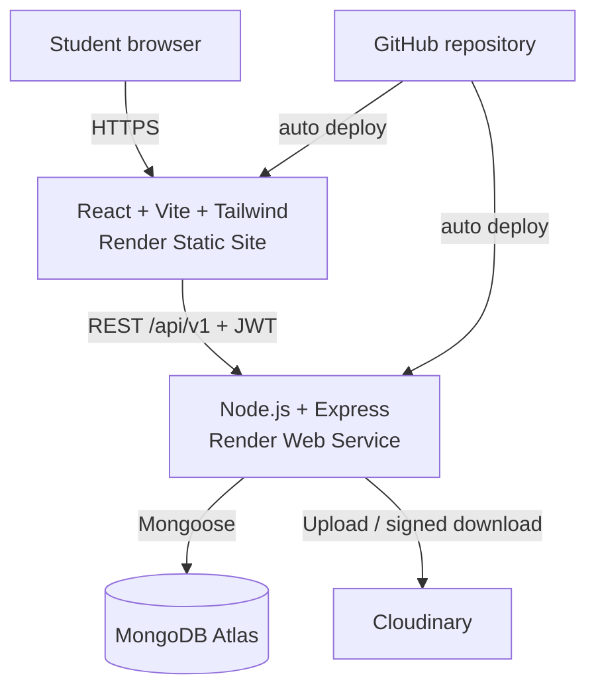
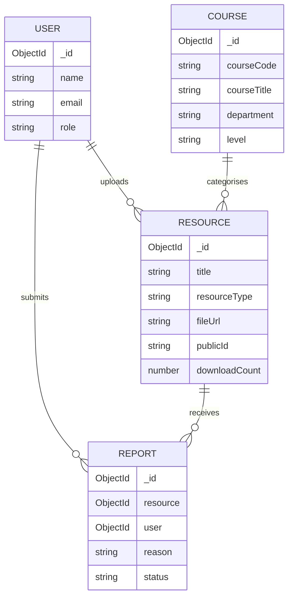
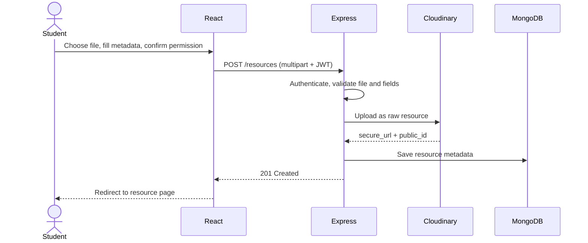

# StudyShare

**A cloud-based platform for sharing, organising and discovering academic resources.**

| | |
|---|---|
| **Domain** | Education Technology (EdTech) |
| **Type** | Cloud-based web application (MERN stack) |
| **Live app** | `https://<your-frontend>.onrender.com` |
| **API** | `https://<your-backend>.onrender.com/api/v1` |
| **Repository** | `https://github.com/<your-username>/studyshare` |

---

## 1. Abstract

Students receive most of their academic materials through WhatsApp groups, Telegram channels, email and personal cloud storage. These channels make sharing easy but make finding anything hard: files have inconsistent names, nothing is organised by course, and resources disappear when a student leaves a group or changes phone.

StudyShare replaces that scatter with one searchable repository. Students register, upload course materials with structured metadata (title, description, course, resource type), browse and filter what others have shared, download files, and report content that is inappropriate or shared without permission. Administrators manage courses, users and reports.

The application is built with React, Node.js, Express and MongoDB, stores files on Cloudinary, and is deployed entirely on Render: the API as a **web service** and the React frontend as a **static site**. This document covers the research behind the project, the system design, the deployment process, testing, and the problems solved along the way.

---

## 2. Problem Statement

The problem is not a lack of educational material. It is a problem of **discoverability, organisation, accessibility and responsible sharing**. A student looking for past questions for one course may have to scroll through several group chats, ask classmates to resend files, or search personal storage. Specifically:

- Files are spread across platforms and formats.
- File names are inconsistent, so search does not work.
- Resources are not tied to a course or level, and old material mixes with new.
- Students cannot easily judge whether a file is relevant or trustworthy.
- Material is lost when groups are left or devices change.
- Nobody checks whether a shared document may legally be redistributed.

StudyShare treats these as design requirements: structured metadata for organisation, search and filters for discovery, a permission confirmation for responsible sharing, and a reporting workflow for moderation.

---

## 3. Research and Literature Review

**Open Educational Resources.** UNESCO defines Open Educational Resources (OER) as teaching, learning and research materials in the public domain or released under an open licence that permits access, reuse, adaptation and redistribution. The point matters for this project: not every document a student holds can be redistributed. StudyShare therefore requires every uploader to confirm they have permission to share, and provides a report mechanism for anything that slips through.

**Benefits and challenges.** A systematic review by Adil, Ali, Sultan, Ashiq and Rafiq examined 21 studies on OER. Benefits included wider access to knowledge, support for lifelong learning and pedagogical gains. Challenges included difficulty finding appropriate resources, low awareness of copyright, quality assurance, technological limits and weak organisational support. The "finding resources" and "copyright" challenges map directly onto StudyShare's search/filter design and its permission and reporting features.

**Digital access.** UNESCO's 2023 Global Education Monitoring Report notes that technology can widen access to content, but devices, connectivity, digital skills and suitable content remain unevenly distributed, and the sheer volume of material makes quality and relevance hard to judge. This argued for a lightweight, responsive interface, paginated lists and common document formats rather than a heavy platform. The project does not claim that a repository solves educational inequality or raises grades; it makes existing resources easier to organise and find.

**Nigerian context.** Lawal and Viatonu studied 585 students across 12 public and private universities in Southwest Nigeria and examined differences in access to and use of learning resources. This supports building a student-centred tool that works across institutions instead of one tied to a single university's internal system.

### Research findings and design responses

| Finding | StudyShare response |
|---|---|
| Students need access to learning materials | Centralised resource repository |
| Finding relevant resources takes time | Keyword search, filters, pagination |
| Resources can carry copyright restrictions | Mandatory sharing-permission confirmation |
| Quality and relevance are hard to judge | Descriptions, course details, uploader name, reporting |
| Digital access can be limited | Lightweight, responsive interface |
| Large volumes become unmanageable | Categories, metadata, pagination, database indexes |

---

## 4. Aim and Objectives

**Aim:** to design, build and deploy a secure cloud-based platform that lets students share, organise, discover and access academic resources.

**Objectives**

1. Build a centralised platform for sharing academic resources.
2. Categorise resources by course and resource type.
3. Implement secure registration and authentication.
4. Provide search and filtering.
5. Let authenticated students upload permitted documents.
6. Store application data in MongoDB and files in cloud storage.
7. Enforce access control on user-owned resources.
8. Provide a reporting and moderation mechanism.
9. Deploy to a public cloud environment.
10. Test functionality, usability, security and responsiveness.

---

## 5. Features and Scope

**Included in version 1**

- Student registration, login and profile
- Resource upload with title, description, course, type and a permission confirmation
- Browse, keyword search and filter by course and type, with pagination
- Resource detail page with file information and download counter
- Authenticated download that keeps the original file name
- "My resources" with edit and delete for the owner
- Report a resource, with a reason and optional details
- Admin area: courses, users and report review

**Deliberately excluded:** live chat, video conferencing, online exams, payments, AI recommendations, plagiarism detection, institutional record integration, native mobile apps and full LMS functionality. Keeping the scope narrow made it possible to finish, deploy and test a complete product.

---

## 6. System Architecture

StudyShare is a MERN-style application with the frontend and backend deployed independently.



### Technology stack

| Layer | Technology | Purpose |
|---|---|---|
| Frontend | React, Vite, React Router | UI and routing |
| Styling | Tailwind CSS | Responsive design |
| Backend | Node.js, Express | REST API |
| Database | MongoDB Atlas, Mongoose | Application data and schemas |
| Auth | JWT, bcrypt | Authentication and password hashing |
| Uploads | Multer | Multipart handling and validation |
| File storage | Cloudinary | Document storage and delivery |
| Hosting | Render (web service + static site) | Public deployment |
| Source control | Git, GitHub | Version control and deploy trigger |

### Why these choices

- **React** suits the many reusable pieces: resource cards, filters, forms, modals and dashboards.
- **Express and Node** keep one language across the stack.
- **MongoDB** stores flexible resource metadata, and **Atlas** removes the burden of running a database server.
- **Cloudinary** keeps large binary files out of the database, so MongoDB holds only the URL, public ID and metadata.
- **Render** hosts both halves under one dashboard, deploying on every push, with free HTTPS on both.

---

## 7. Data Model



- **Users:** name, email, hashed password, role (`student` or `admin`).
- **Courses:** course code, title, department and level. Resources reference a course by ObjectId rather than copying its details, so a course is edited in one place. This refines the original proposal, which stored course fields directly on each resource.
- **Resources:** title, description, course reference, resource type, `fileUrl`, Cloudinary `publicId`, original `fileName`, `fileSize`, `uploadedBy`, `sharingPermissionConfirmed` and `downloadCount`.
- **Reports:** resource reference, reporting user, reason, description and a status of `pending`, `reviewed`, `resolved` or `dismissed`.

Search uses a MongoDB text index, and list queries are paginated with the page size capped at 50.

---

## 8. API Design

All routes are prefixed with `/api/v1` and, apart from registration and login, sit behind the `protect` middleware.

| Area | Endpoints |
|---|---|
| Auth | `POST /auth/register`, `POST /auth/login`, `GET /auth/profile` |
| Admin | `POST /admin/register`, `POST /admin/login`, `GET /admin/users`, `DELETE /admin/users/:id` |
| Courses | `GET /courses`, `GET /courses/:id`, `POST /courses`, `PUT /courses/:id`, `DELETE /courses/:id` |
| Resources | `GET /resources` (search, type, course, page, limit), `GET /resources/:id`, `POST /resources`, `PUT /resources/:id`, `DELETE /resources/:id`, `GET /resources/:id/download` |
| Reports | `POST /reports`, `GET /reports`, `GET /reports/:id`, `PUT /reports/:id`, `DELETE /reports/:id` |

The frontend wraps every endpoint in a single `api` object (`lib/api.js`), so components never build URLs by hand and errors surface uniformly as toasts.

---

## 9. Security Design

- **Passwords** are hashed with bcrypt and never stored or returned in plain text.
- **Authentication** uses JWTs. The `protect` middleware rejects requests without a valid token and attaches `req.user`.
- **Authorisation** is enforced on the server. Only the owner can update a resource; the owner or an admin can delete one. A student cannot edit or delete another student's upload, whatever the frontend shows.
- **Upload validation** happens on the server and does not rely on frontend checks. Multer enforces a 10 MB limit and a file-type allowlist on both extension and MIME type, and the controller verifies required metadata, that the course exists and that the permission box was ticked.
- **Temporary files** written by Multer are deleted after the Cloudinary upload, and also on failure.
- **Secrets** (database URI, JWT secret, Cloudinary keys) live in environment variables configured in the Render dashboard and are never committed.
- **CORS** is restricted to the deployed frontend origin through `CLIENT_URL`.
- **Downloads** are issued by the API as short-lived links (section 10), so the backend decides who may download and counts each download.

---

## 10. Key Workflows

### Upload



### Download

The download button calls `GET /resources/:id/download`. The API atomically increments `downloadCount` in MongoDB and returns a Cloudinary download URL that expires after 60 seconds and carries the original file name. The browser then downloads the file. Because the counter lives in the database, the number shown is the same for every user and survives refreshes.

### Reporting and moderation

Any student who is not the owner can report a resource, choosing a reason and adding optional details. Reports enter the admin queue as `pending`, and an admin moves them to `reviewed`, `resolved` or `dismissed`, deleting the resource where necessary.

---

## 11. Frontend Design

The interface is built with React, Vite and Tailwind CSS around a small design system: a cobalt primary colour, near-black ink for text, a soft canvas background and a highlighter-yellow accent for primary actions. Shared components (`Button`, `Badge`, `Modal`, `Field`, `Input`, `Select`, `Textarea`, `Loading`, `Empty`, toasts) keep screens consistent.

- **Responsive:** layouts use Tailwind's responsive grid and flex utilities, tested at phone, tablet and desktop widths.
- **Accessible:** semantic elements, labelled form fields, keyboard-operable controls, `role="alert"` on errors and readable contrast.
- **Honest states:** every page handles loading, empty and error states, and failed requests show a toast with the server's message instead of failing silently.
- **State:** an `AuthContext` holds the user and role. The token is kept in local storage and sent as a bearer header on each request.

---

## 12. Deployment on Render

Both halves are deployed on Render from the same GitHub repository, and each redeploys automatically when its branch is pushed.

### Backend: Render Web Service

| Setting | Value |
|---|---|
| Root directory | `server` |
| Build command | `npm install` |
| Start command | `node server.js` |

Environment variables:

```env
MONGODB_URI=
JWT_SECRET=
CLOUDINARY_CLOUD_NAME=
CLOUDINARY_API_KEY=
CLOUDINARY_API_SECRET=
CLIENT_URL=https://<your-frontend>.onrender.com
```

### Frontend: Render Static Site

| Setting | Value |
|---|---|
| Root directory | `client` |
| Build command | `npm install && npm run build` |
| Publish directory | `dist` |

Environment variable (read at **build time** by Vite):

```env
VITE_API_URL=https://<your-backend>.onrender.com/api/v1
```

Because the app is a single-page application, the static site needs a **rewrite rule** (`/*` to `/index.html`) so refreshing or opening a deep link such as `/resources/123` loads the app instead of a 404.

### Database and storage

- **MongoDB Atlas:** a database user was created and network access was configured so the Render service can connect.
- **Cloudinary:** credentials are supplied only through environment variables.

### Deployment order

1. Create the Atlas cluster and the Cloudinary account.
2. Deploy the backend and note its public URL.
3. Set `VITE_API_URL` to that URL and deploy the static site.
4. Copy the frontend URL into `CLIENT_URL` on the backend and redeploy so CORS accepts it.
5. Run the smoke tests in section 13 against the live URLs.

### Deployment notes

- Render web service disks are not permanent, which suits this design: Multer's temporary files are deleted after upload and the permanent copy lives on Cloudinary.
- Free-tier web services can spin down when idle, so the first request after a quiet period may be slow. A paid instance removes this.

---

## 13. Testing

Testing combined manual and API-level checks against both local and deployed environments.

| Area | What was checked |
|---|---|
| Authentication | Register, login, invalid credentials, access to protected routes without a token |
| Authorisation | Student A cannot edit or delete Student B's resource; non-admins cannot reach admin routes |
| Upload | Valid file, missing fields, missing file, oversized file, disallowed type, unticked permission box |
| Discovery | Keyword search, type and course filters, pagination edges |
| Download | File downloads with its original name and the counter increments in the database |
| Reporting | Report submission, admin status updates |
| Responsiveness | Phone, tablet and desktop layouts |
| Deployment | Full journey on the live URLs, deep-link refresh, CORS |

API calls were exercised with Postman or Thunder Client. Several defects found this way are described next.

---

## 14. Challenges and Lessons Learned

**1. Cloudinary returned `401 deny or ACL failure` on PDFs.** Files uploaded correctly as public `raw` resources but could not be opened. The cause was an account-level restriction on PDF and ZIP delivery, not the code. The fix was twofold: the setting can be changed in the Cloudinary console, and downloads now go through the API, which issues a short-lived link. This also gave the backend control over who can download.

**2. The download counter was not real.** It was first incremented only in React state, so it reset on refresh and differed between users. Moving the increment into the download endpoint made it a persistent database value.

**3. A `ReferenceError` surfaced as a client error.** The report controller validated a `user` variable that was never defined, and a catch block returned status 400 for everything, so a server bug looked like bad input. The fix was to use `req.user._id` and return 500 for unexpected exceptions. Error status codes should reflect who is at fault.

**4. A file-type regex rejected valid files.** The first Multer filter tested a loose regex against MIME types, which does not match legacy Word files (`application/msword`). It was replaced with an explicit map of allowed MIME types to extensions, checked on the server regardless of the frontend.

**5. A naming mismatch between layers.** The frontend called `api.downloadResource` while the API client exported `download`. A single API client module makes such mismatches easy to find and fix.

**Lessons:** validate on the server and never rely on the UI; keep secrets in environment variables; centralise API calls; treat third-party account settings as part of the system; and test deployed behaviour, since CORS, environment variables and routing differ from local development.

---

## 15. Limitations and Future Work

**Limitations**

- Content quality and copyright cannot be verified automatically; the system relies on uploader confirmation, reports and admin review.
- Moderation is manual, with no automated scanning.
- Users still need internet access, and StudyShare does not replace an institution's LMS.
- The project makes no claim that access to shared resources improves grades.

**Future work**

- Atlas Search for typo-tolerant full-text search
- Background malware scanning of uploads
- Email notifications and password reset
- Ratings or "helpful" votes to surface quality
- Institution-specific communities and multi-institution support
- Caching and CDN-backed document delivery for larger scale
- Automated frontend and API test suites in CI

---

## 16. Running Locally

```bash
git clone https://github.com/<your-username>/studyshare.git
cd studyshare
```

**Backend**

```bash
cd server
npm install
# create .env with MONGODB_URI, JWT_SECRET, CLOUDINARY_* and CLIENT_URL=http://localhost:5173
npm run dev          # API on http://localhost:5000
```

**Frontend**

```bash
cd client
npm install
# optional .env: VITE_API_URL=http://localhost:5000/api/v1
npm run dev          # app on http://localhost:5173
```

Register an admin through the admin registration route, add at least one course, then log in as a student to upload and browse resources.

---

## 17. Conclusion

StudyShare addresses a practical problem: academic resources that live in informal channels are hard to find, organise and reuse. Research on Open Educational Resources supports improving access while highlighting discoverability, copyright and quality as the real obstacles, and the platform answers these with structured metadata, search and filters, mandatory permission confirmation, and a reporting workflow.

The result is a complete, deployed application: a React frontend served as a Render static site, an Express API running as a Render web service, MongoDB Atlas for data and Cloudinary for files. It demonstrates authentication, authorisation, file handling, cloud storage and deployment, and it was kept deliberately focused on sharing and discovery so it could be finished and tested properly.

---

## References

1. UNESCO. *Recommendation on Open Educational Resources (OER)*, 2019.
2. UNESCO. *Global Education Monitoring Report 2023: Technology in Education, A Tool on Whose Terms?* UNESCO, 2023.
3. UNESCO and Commonwealth of Learning. *Guidelines for Open Educational Resources (OER) in Higher Education.*
4. Adil, H. M., Ali, S., Sultan, M., Ashiq, M., and Rafiq, M. *Open Education Resources' Benefits and Challenges in the Academic World: A Systematic Review.* Global Knowledge, Memory and Communication. DOI: 10.1108/GKMC-02-2022-0049.
5. Lawal, B. O., and Viatonu, O. *A Comparative Study of Students' Access to and Utilization of Learning Resources in Selected Public and Private Universities in Southwest, Nigeria.* Journal of Education and Practice, 2017.
6. MongoDB. *MongoDB Atlas Documentation.*
7. Cloudinary. *Cloudinary Upload Documentation.*
8. Render. *Render Documentation: Web Services and Static Sites.*
